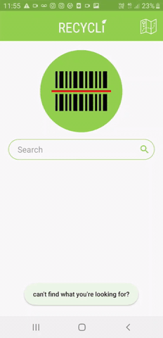
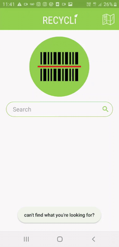
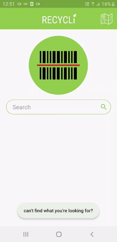

# csc344_proj
This project was created for my undergrad project for Computer Science BSc (Hons). The application, RECYCLi, allows the user to search for specific food products and in turn the application will display the materials each component of the product’s packaging is made up of to allow for more accurate recycling.

# Tools and Languages
- Android Studio
- Java
- XML
- Google Firebase Realtime Database

# Features
- Users can search for products in the database using either the search bar or a barcode scanner.

- Locate nearest recycling centres

- If the user cannot find a product they can add a product to the database to be approved for addition to the database.

# Dissertation

[Recycli: A Mobile Application to Promote the Recycling of Food Packaging](https://drive.google.com/file/d/188uhMAWlTw2YX9CBKQoRXRvAx0K2S1-k/view?usp=sharing)

# Grade Outcome
- Project: 72%
- Dissertation: 81%
